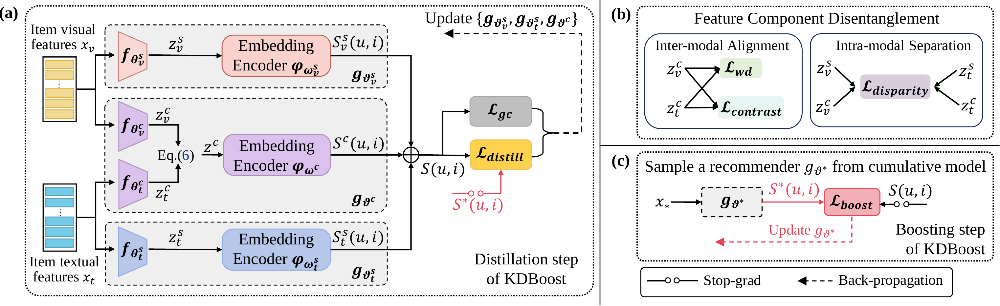
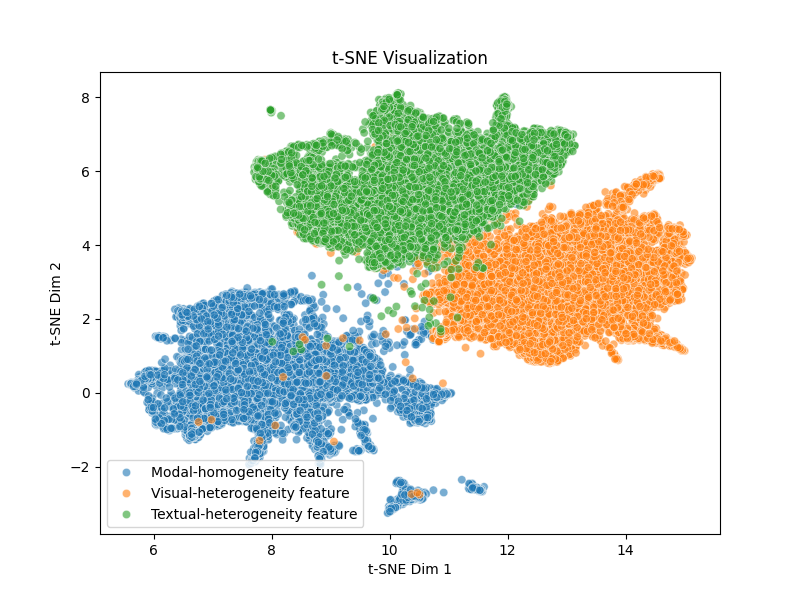
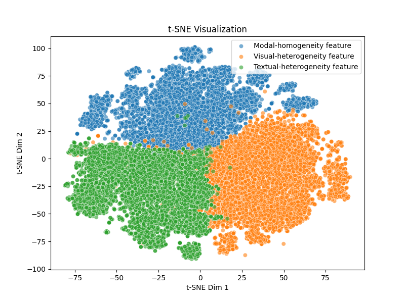
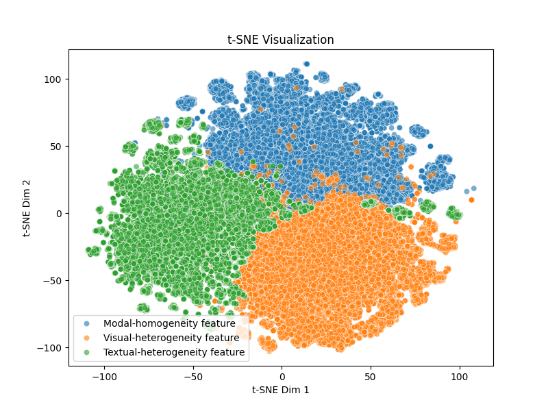

# D3ER: On the Disentangle and Ensemble of Multi-Modal Recommendation

This is the PyTorch implementation for **D3ER** proposed in the paper **D3ER: On the Disentangle and Ensemble of Multi-Modal Recommendation**.



## T-SNE Visualization

<center class="half">



</center>

## 🚀 How to run the code

The command lines to train D3ER are as below.


```python
python Main.py --data {dataset_name}
```
