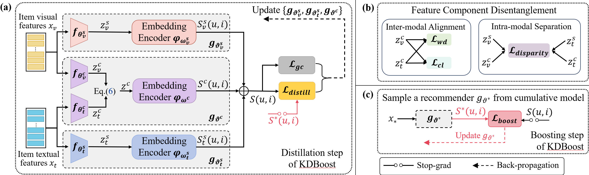

# D3ER: On the Disentangle and Ensemble of Multi-Modal Recommendation

This is the PyTorch implementation for **D3ER** proposed in the paper **D3ER: On the Disentangle and Ensemble of Multi-Modal Recommendation**.
<center>

</center>


## 🚀 How to run the code

The command lines to train D3ER are as below.


```python
python Main.py --data {dataset_name}
```
